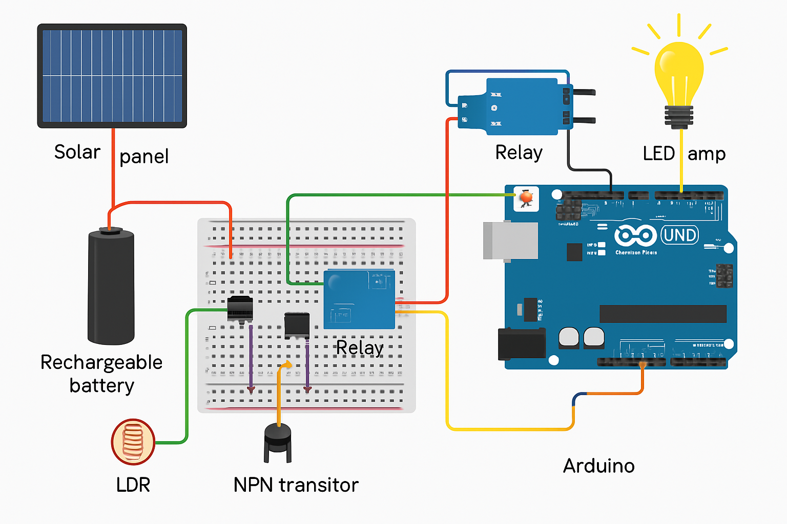

# 🌙 Automatic Night Lamp using LDR, Transistor, and Solar Panel

---

## 📝 Description

This project presents an **energy-efficient automatic lighting system** that uses an **LDR**, **transistor**, and **relay** to control an LED lamp based on ambient light. A **solar panel** charges a **battery** during the day, enabling the lamp to operate independently at night without relying on the electrical grid.

An **Arduino Uno** enhances functionality by reading LDR values and controlling the system accordingly. It allows for:

- Automatic switching based on ambient light  
- Adjustable brightness (PWM)  
- Motion detection (optional)  
- Timed lighting functionality  

This eco-friendly and cost-effective solution is ideal for **sustainable off-grid lighting**, minimizing energy consumption and maximizing automation.

---

## ⚙️ Technologies & Components

- Arduino Uno  
- LDR (Light Dependent Resistor)  
- Transistor (e.g., BC547)  
- Relay Module  
- LED Lamp  
- Solar Panel  
- Rechargeable Battery  
- *(Optional)* PIR Motion Sensor  

---

## 📁 Arduino Code

The Arduino sketch is located in the [`LDRCode.ino`](./arduino_code) directory of this repository.  
> 📌 File extension: `.ino`

---

## 👤 Author

Made with 💡 by [@Mael-12](https://github.com/Mael-12)

---

## 📸 Preview

